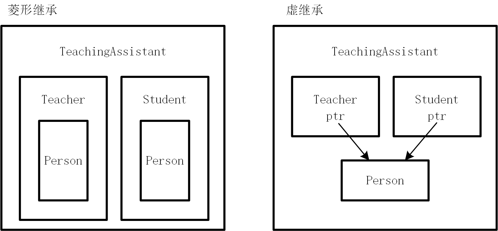

# C++基本语法

- 变量，数据类型

```cpp
bool flag = true;
```

- 命名空间的概念

最常用的是标准库的命名空间了。在C++项目中，同一个函数名称可能会在不同的文件中多次出现，为了解决这种命名冲突，就有了命名空间的概念。std是C++标准库的命名空间，是一个庞大的工具集。

```cpp
// 使用std命名空间的内容
std::string

using std::cout;
cout << "This is a message." << endl;

using namespace std; 
cout << greeting << "World!" << endl;
vector<int> numbers = {1, 2, 3};
```

- 常用头文件

```cpp
<iostream>	输入输出：cin, cout
<string>	字符串类 std::string
<vector>	向量容器（动态数组）
<algorithm>	排序、查找、最大最小值等算法
<cmath>		数学函数：pow, sqrt, sin, 等
<cstdlib>	随机数生成、内存分配等
<ctime>		时间函数如 time, clock 等
<fstream>	文件流：读写文件
```

- 输入输出操作

```c
std::cin >> age;
std::cout << "Age: " << age << std::endl;	/* 表明std命名空间中的cout队形 */

int x = 10;

class A {
public:
    static int x;
};
int A::x = 20;

std::cout << x;      // 全局的x
std::cout << A::x;   // A类中的x
```

1. **`::`**表示作用域解析运算符，用于指明空间或者类的作用域。

2. **cout**对象表述标准输出流。

3. **cin**对象表示标准输入流。

引用: 引用就是某个变量的**别名**，它**并不独立地占用内存**，而是直接**绑定到另一个已有的变量**。你对引用做的任何操作，实际上就是对原变量的操作。

```cpp
int a = 10;
int &x = a;

void addOne(int& x) {
    x += 1;
}

int& getRef(int& x) {
    return x;
}

// 遍历容器中的每一个元素
// vec 是一个容器，例如 std::vector<int> vec = {1, 2, 3};
// n 是 vec 中的一个元素。
// int& 表示 n 是对该元素的 引用（reference），这样你可以直接修改容器中的元素。
for (int& n : vec) {
    n += 1; // 修改 vec 中的元素
}

```

## 常用关键字，数据类型，运算符

关键字

```cpp
/* 类与面向对象 */
class		定义类
struct		定义结构体（默认 public）
public		公有访问权限
private		私有访问权限（类默认）
protected	受保护访问权限
virtual		虚函数（支持多态）
override	明确重写父类虚函数（C++11）
final		禁止子类重写（C++11）
this		当前对象指针
new			动态分配内存
delete		释放动态内存
friend		友元函数/类
explicit	禁止构造函数隐式转换
inline		请求内联函数
    
/* 模板和泛型编程 */
template	模板定义
typename	表示类型参数
constexpr	编译期常量（C++11）

/* 类型 */
int*	指针类型
int&	引用类型
int[]	数组类型
std::string	字符串（C++类）
```

- new


核心功能是在堆上分配内存，并返回指向该内存的一个指针。销毁使用delete。主要功能有两个：
1. 为单个对象分配内存。
2. 为数组分配内存。

```cpp
// 为单个对象分配内存
pointer = new TypeName;
pointer = new TypeName(initial_value);

// new运算符会首先向操作系统申请一块足够存储`TypeName`类型的内存。如果内存分配成功会自动调用这个对`TypeName`类型的构造函数，在这块新分配的内存中初始化一个对象。

// 基于此，接下来介绍一下什么是构造函数
// 对于一个类class Person，在该类型的对创建时（new）构造函数会被自动调用，为该对象赋初值。
// 构造函数可重载（参数列表不同即可）
// 构造函数名必须与类名一致
/** 
 * pref: 构造函数举例
 */
#include <iostream>
#include <string>

class Person {
public:
    // 默认构造函数（无参数）
    Person() {
        name = "Unknown";
        age = 0;
        std::cout << "Default constructor called." << std::endl;
    }

    // 带参数的构造函数
    Person(std::string n, int a) {
        name = n;
        age = a;
        std::cout << "Parameterized constructor called." << std::endl;
    }

    void display() {
        std::cout << "Name: " << name << ", Age: " << age << std::endl;
    }

private:
    std::string name;
    int age;
};

int main() {
    Person p1;             // 调用默认构造函数
    Person p2("Alice", 30); // 调用带参数的构造函数

    p1.display();
    p2.display();

    return 0;
}
// 分配数组
int* arr = new int[10]; // 分配并默认初始化10个int
delete[] arr;           // 正确释放数组

// 自动计算大小
int* p = new int;
```

- new和melloc的区别

1. new可以自动计算内存大小
2. new可以自动调用构造函数，delete可以自动调用析构函数
3. new返回正确类型的指针，无需强制类型转换。

## 分支结构

同C语言

## 数组，字符串，指针，函数，结构体

数组

```cpp
/* 首先兼容C语言的数组操作 */
#include <array>
#include <vector>

// std::array：固定长度
std::array<int, 5> arr = {1,2,3,4,5};

// std::vector：动态数组
std::vector<int> vec = {1,2,3};
vec.push_back(4);
```

字符串相关操作

```c
// 构造方式
std::string s1;                    // 空字符串
std::string s2("hello");          // C 字符串构造
std::string s3(s2);               // 拷贝构造
std::string s4(s2, 1, 2);         // 从 s2[1] 开始取 2 个字符
std::string s5(5, 'x');           // “xxxxx”
// 赋值
s1 = "world";
s1.assign("abc", 3);
s1 += "!";
s1.append(s2);
//

std::string s = "Hi"; 	 创建字符串	
s.length() or s.size()	 获取长度	
s[0], s.at(1)			 访问某个字符	
s += " world";		     拼接字符串	
s.substr(0, 3)			 子串		
s.find("ice")			 查找子串	
s1 == s2, s1 < s2		 比较字符串	
s.begin() s.end()
    
.clear()：空字符串，但不改变 capacity。
.insert(...)：在指定位置插入字符或子串。
.erase(pos, len) 或 .erase(it1, it2)：删除字符或范围。
.replace(...)：替换指定范围为其他内容。
.push_back(c) 与 .append(...)：末尾添加字符或子串
```

指针

```cpp
int* p = nullptr;  // 空指针，避免野指针
int arr[3] = {1, 2, 3};
int* p = arr;      // 等价于 int* p = &arr[0];
```

函数

```cpp
// 内联函数 inline
// 建议编译器把函数展开，适合小函数，减少函数调用的损耗

// 函数重载
就是作用域内允许多个重名函数出现，但参数列表不同。
```

结构体

```cpp
std::vector<Student> v;
v.push_back({"Mike", 18, 75.0});
v.push_back(stu1);
```

# 面向对象

## 封装

- 封装是将**数据**和操作数据的**方法**捆绑到一个单元中。对外部隐藏对象的内部实现细节，仅通过有限受控的接口与外部进行交互。

- 通过访问限定符实现封装

  - public、private、protected

  ```cpp
  // public: 任何地方都可以访问。类的内部、子类、类的外部（通过对象）都可以直接访问public成员。
  // private: 只能在类的内部访问。子类和类的外部都无法直接访问private成员。
  // protected: 只能在类的内部和其派生类（子类）中访问。类的外部无法访问。为继承设计的“半私有”成员。
  
  #include <iostream>
  #include <string>
  
  class BankAccount {
  // --- 私有部分：数据和内部实现 ---
  private:
      // 数据成员（属性）被设为private，以保护它们
      std::string ownerName;
      double balance;
      int accountNumber;
  
      // 一个私有辅助函数，用于内部记录日志，外部不需要知道
      void logTransaction(const std::string& action, double amount) {
          std::cout << "[LOG] Account " << accountNumber << ": " << action << " of " << amount << std::endl;
      }
  
  
  // --- 公共部分：对外接口 ---
  public:
      // 构造函数：用于创建和初始化对象
      BankAccount(std::string name, int accNum, double initialDeposit) {
          ownerName = name;
          accountNumber = accNum;
          // 即使是初始存款，也通过deposit方法，以保证逻辑统一
          balance = 0; // 先设为0
          deposit(initialDeposit); // 再调用存款方法
          std::cout << "Account for " << ownerName << " created successfully." << std::endl;
      }
  
      // 公共接口：存款
      void deposit(double amount) {
          if (amount > 0) {
              balance += amount;
              logTransaction("Deposit", amount);
          } else {
              std::cout << "Error: Deposit amount must be positive." << std::endl;
          }
      }
  
      // 公共接口：取款
      void withdraw(double amount) {
          if (amount <= 0) {
              std::cout << "Error: Withdrawal amount must be positive." << std::endl;
              return;
          }
          if (amount > balance) {
              std::cout << "Error: Insufficient funds. Withdrawal failed." << std::endl;
          } else {
              balance -= amount;
              logTransaction("Withdrawal", amount);
          }
      }
  
      // 公共接口：查询余额
      // 注意：它返回一个副本，而不是balance的引用，防止外部通过引用修改
      double getBalance() const {
          return balance;
      }
      
      // 公共接口：显示账户信息
      void displayInfo() const {
          std::cout << "------------------------" << std::endl;
          std::cout << "Account Holder: " << ownerName << std::endl;
          std::cout << "Account Number: " << accountNumber << std::endl;
          std::cout << "Current Balance: " << balance << std::endl;
          std::cout << "------------------------" << std::endl;
      }
  }; // 类定义结束
  
  int main() {
      // 创建一个BankAccount对象
      BankAccount myAccount("Alice", 12345678, 1000.0);
      myAccount.displayInfo();
  
      // 通过公共接口进行操作
      std::cout << "\n--- Attempting to deposit 500 ---" << std::endl;
      myAccount.deposit(500.0);
      myAccount.displayInfo();
  
      std::cout << "\n--- Attempting to withdraw 200 ---" << std::endl;
      myAccount.withdraw(200.0);
      myAccount.displayInfo();
  
      std::cout << "\n--- Attempting to withdraw 2000 (insufficient funds) ---" << std::endl;
      myAccount.withdraw(2000.0);
      myAccount.displayInfo();
  
      // --- 以下代码是错误的，无法通过编译，体现了封装的安全性 ---
      // myAccount.balance = 1000000; // 错误！'double BankAccount::balance' is private
      // myAccount.accountNumber = 999; // 错误！'int BankAccount::accountNumber' is private
      // myAccount.logTransaction("Hacking", 0); // 错误！'void BankAccount::logTransaction(...)' is private
  
      return 0;
  }
  ```

  - const关键字

    void displayInfo() const; 表示这个函数是只读的，不会修改对象的内容。

  - 构造函数的一种写法

  ```cpp
  class MyClass {
  private:
      int secret;
  public:
      MyClass(int s) : secret(s) {}
      // 声明友元函数
      friend void showSecret(const MyClass& obj);
  };
  // secret(s)表示将成员secret属性赋值为s
  ```


### 友元

```cpp
// 友元函数：非成员函数可以访问类的私有成员
class MyClass {
private:
    int secret;
public:
    MyClass(int s) : secret(s) {}
    // 声明友元函数
    friend void showSecret(const MyClass& obj);
};
 
// 友元函数定义（可以访问 MyClass 的私有成员）
void showSecret(const MyClass& obj) {
    std::cout << "Secret: " << obj.secret << std::endl;
}
 
int main() {
    MyClass obj(42);
    showSecret(obj); // 输出: Secret: 42
    return 0;
}

// 友元类：一个类的所有成员函数能够访问另一个类的所有私有成员
class SecretHolder {
private:
    int data;
public:
    SecretHolder(int d) : data(d) {}
    // 声明友元类
    friend class FriendClass;
};
 
class FriendClass {
public:
    void accessSecret(const SecretHolder& holder) {
        std::cout << "Data: " << holder.data << std::endl; // 合法访问
    }
};
 
int main() {
    SecretHolder holder(100);
    FriendClass friendObj;
    friendObj.accessSecret(holder); // 输出: Data: 100
    return 0;
}
// 友元成员函数：某个类的成员函数可以访问另一个类的私有成员
class A {
private:
    int x;
public:
    A(int val) : x(val) {}
    // 声明类 B 的成员函数为友元
    friend void B::printX(const A& obj);
};
 
class B {
public:
    void printX(const A& obj) {
        std::cout << "A::x = " << obj.x << std::endl; // 合法访问
    }
};
 
int main() {
    A a(10);
    B b;
    b.printX(a); // 输出: A::x = 10
    return 0;
}
```

## 构造函数和析构函数

### 拷贝构造函数

默认构造函数，带参数的构造函数，初始化列表

- 更推荐初始化列表的方式，对于类类型成员，初始化列表是直接调用其构造函数进行初始化；而在构造函数体内赋值，则是先调用默认构造函数创建一个临时对象，然后再用赋值操作符覆盖。前者效率更高。

- 拷贝构造函数

**用于创建一个与现有对象完全相同的新对象**，它的参数是对同类对象的**常量引用const ClassName&**。如果没有定义拷贝构造函数，编译器会生成一个默认的拷贝构造函数，它会进行**浅拷贝**。

### 浅拷贝

危险性：默认的浅拷贝在拷贝默认的指针成员的时候，只是拷贝一个指针，指针的内容不会被拷贝，这会导致调用析构函数的时候可能会重复释放同一块内存。

```cpp
#include <cstring>
class ShallowCopy {
private:
    char* data;
public:
    ShallowCopy(const char* str) {
        data = new char[strlen(str) + 1];
        strcpy(data, str);
    }
    // ~ShallowCopy() { delete[] data; } // 析构函数，后面会讲

    // 默认拷贝构造函数是浅拷贝，会导致问题
};

void problem_demo() {
    ShallowCopy s1("Hello");
    ShallowCopy s2 = s1; // 调用默认拷贝构造函数，s1.data 和 s2.data 指向同一块内存
    // 当 s1 和 s2 析构时，会尝试 delete[] 同一块内存两次，导致程序崩溃！
}
```

### 深拷贝

当类中包含指针成员或动态分配的资源时，你必须**显式地定义拷贝构造函数**，自己为新对象分配独立的内存并复制内容，这就是**深拷贝**（Deep Copy）。

```cpp
class DeepCopy {
private:
    char* data;
public:
    DeepCopy(const char* str) {
        data = new char[strlen(str) + 1];
        strcpy(data, str);
    }

    // 显式定义的拷贝构造函数，实现深拷贝
    DeepCopy(const DeepCopy& other) {
        data = new char[strlen(other.data) + 1];  // 1. 为新对象分配新内存
        strcpy(data, other.data);                 // 2. 复制内容
        std::cout << "深拷贝构造函数被调用" << std::endl;
    }

    ~DeepCopy() {
        delete[] data;
    }
};
```

### 析构函数

释放资源、自动调用、不能重载、先构造的对象后析构，后构造的对象先析构。

**如果在构造函数中使用了new，那么就需要在析构函数中显式定义一个析构函数来释放这些资源**。如果不定义，那么默认的析构函数只会消除指针本身，而不会释放指针指向的内存。

`delete[]`操作符专门用于释放`new[]`创建的动态数组。

| 操作     | 创建单个对象 | 创建对象数组     |
| -------- | ------------ | ---------------- |
| 分配内存 | `new int`    | `new int[10]`    |
| 释放内存 | `delete p`   | `delete[] p_arr` |

```cpp
#include <iostream>
#include <cstring>

class ResourceHolder {
private:
    char* buffer;
    int size;

public:
    // 构造函数：获取资源
    ResourceHolder(int s) : size(s) {
        buffer = new char[size]; // 动态分配内存
        std::cout << "构造函数: 分配了 " << size << " 字节的内存" << std::endl;
    }

    // 析构函数：释放资源
    ~ResourceHolder() {
        delete[] buffer; // 释放动态分配的内存
        std::cout << "析构函数: 释放了内存" << std::endl;
        buffer = nullptr; // 好习惯，避免悬垂指针
    }

    void doSomething() {
        std::cout << "正在使用资源..." << std::endl;
    }
};

void createAndDestroy() {
    std::cout << "进入 createAndDestroy 函数" << std::endl;
    ResourceHolder holder(1024); // 创建对象，调用构造函数
    holder.doSomething();
    std::cout << "即将离开 createAndDestroy 函数" << std::endl;
} // 离开作用域，holder 对象被销毁，自动调用析构函数

int main() {
    createAndDestroy();
    std::cout << "已回到 main 函数" << std::endl;
    return 0;
}
```


### 类对象作为类成员和静态成员

关键点是类对象的成员初始化列表。成员对象的构造顺序由它们**在类中的声明顺序决定**

```cpp
#include <iostream>
#include <string>

// 部件类：引擎
class Engine {
public:
    Engine(const std::string& type) : m_type(type) {
        std::cout << "Engine " << m_type << " constructed." << std::endl;
    }
    void start() {
        std::cout << "Engine " << m_type << " is starting... Vroom!" << std::endl;
    }
    ~Engine() {
        std::cout << "Engine " << m_type << " destructed." << std::endl;
    }
private:
    std::string m_type;
};

// 部件类：轮子
class Wheel {
public:
    Wheel(int id) : m_id(id) {
        std::cout << "Wheel " << m_id << " constructed." << std::endl;
    }
    void rotate() {
        std::cout << "Wheel " << m_id << " is rotating." << std::endl;
    }
    ~Wheel() {
        std::cout << "Wheel " << m_id << " destructed." << std::endl;
    }
private:
    int m_id;
};

// 组合类：汽车
class Car {
public:
    Car(const std::string& engineType)
        // 关键点：成员初始化列表
        : m_engine(engineType), // 调用 Engine 的构造函数
          m_wheel1(1),          // 调用 Wheel 的构造函数
          m_wheel2(2),
          m_wheel3(3),
          m_wheel4(4) {
        std::cout << "Car constructed." << std::endl;
    }

    void drive() {
        std::cout << "Car is about to drive." << std::endl;
        m_engine.start();
        m_wheel1.rotate();
        m_wheel2.rotate();
        m_wheel3.rotate();
        m_wheel4.rotate();
    }

    ~Car() {
        std::cout << "Car destructed." << std::endl;
    }

private:
    // Car 对象“拥有”这些对象
    Engine m_engine;
    Wheel m_wheel1;
    Wheel m_wheel2;
    Wheel m_wheel3;
    Wheel m_wheel4;
};

int main() {
    std::cout << "--- Creating a Car ---" << std::endl;
    Car myCar("V8");
    std::cout << "\n--- Driving the Car ---" << std::endl;
    myCar.drive();
    std::cout << "\n--- Destroying the Car ---" << std::endl;
    // myCar 离开作用域，析构函数被自动调用
    return 0;
}
```

- 静态成员

所有创建的对象都会自动拥有类定义中的静态成员变量

```cpp
// 构造函数
BankAccount(const std::string& name, double initialBalance)
    : m_ownerName(name), m_balance(initialBalance) {
    // 每次创建新账户，总账户数和总存款额都增加
    s_totalAccounts++;
    s_totalBalance += initialBalance;
    std::cout << "Account for " << m_ownerName << " created. Balance: " << m_balance << std::endl;
}
private:
    // 普通成员变量：每个对象都有一份自己的拷贝
    std::string m_ownerName;
    double m_balance;

    // 静态成员变量：所有对象共享同一份
    static int s_totalAccounts;
    static double s_totalBalance;
};
```

## 成员变量与成员函数分开存储

核心思想是数据与行为的分离。

以一段代码为例，图解面向对象的内存模型。类成员函数存放在.text区域，非静态成员变量放在栈区，静态成员变量放在静态数据区。

```cpp
#include <iostream>

class MyClass {
public:
    // 1. 非静态成员变量
    int mA;
    int mB;

    // 2. 静态成员变量
    static int mC; // 声明，不占用对象内存

    // 3. 非静态成员函数
    void show() {
        std::cout << "mA: " << mA << ", mB: " << mB << std::endl;
    }

    // 4. 静态成员函数
    static void staticShow() {
        std::cout << "Static member mC: " << mC << std::endl;
    }
};

// 静态成员变量的定义（分配内存）
int MyClass::mC = 100;

int main() {
    std::cout << "Size of MyClass: " << sizeof(MyClass) << " bytes" << std::endl; // 输出多少？
    MyClass obj1;
    MyClass obj2;

    obj1.mA = 10;
    obj1.mB = 20;
    obj2.mA = 30;
    obj2.mB = 40;

    obj1.show(); // 输出 mA: 10, mB: 20
    obj2.show(); // 输出 mA: 30, mB: 40

    MyClass::staticShow(); // 输出 Static member mC: 100

    return 0;
}
/*****************************************************************************
+---------------------------+
|         代码区            |
| +-----------------------+ |
| | void MyClass::show()  | |  <-- 所有对象共享
| +-----------------------+ |
| | void MyClass::stati.. | |  <-- 所有对象共享
| +-----------------------+ |
+---------------------------+
+---------------------------+
|        静态数据区         |
| +-----------------------+ |
| | MyClass::mC (100)     | |  <-- 全局唯一
| +-----------------------+ |
+---------------------------+
+---------------------------+
|          栈区             |
| +-----------------------+ |
| | obj1                  | |
| |   mA: 10              | |
| |   mB: 20              | |
| +-----------------------+ |
| | obj2                  | |
| |   mA: 30              | |
| |   mB: 40              | |
| +-----------------------+ |
+---------------------------+
*************************************************************************************/
```

| 特性                   | 成员变量                                                     | 成员函数                                                     |
| :--------------------- | :----------------------------------------------------------- | :----------------------------------------------------------- |
| **存储位置**           | **非静态**: 存储在对象内部 (栈/堆) **静态**: 存储在静态数据区 | **所有函数**: 存储在代码区                                   |
| **拷贝数量**           | **非静态**: 每个对象一份 **静态**: 整个类一份                | **所有函数**: 整个类一份，所有对象共享                       |
| **与对象关系**         | **非静态**: 定义了对象的“状态” **静态**: 定义了类的“全局状态” | 定义了对象的“行为”或“操作逻辑”                               |
| **访问机制**           | 直接通过对象地址访问                                         | **非静态**: 通过 `this` 指针隐式访问对象成员 **静态**: 无 `this` 指针，不能访问非静态成员 |
| **对 `sizeof` 的影响** | **非静态**: 直接决定对象大小 **静态**: 无影响                | **所有函数**: 无影响                                         |

### this指针

既然**成员函数在内存中只有一份**，那调用不同对象的成员函数时，函数内部是如何区分要操作哪个对象呢。

当调用一个非静态成员函数时，编译器会隐式地把调用该函数的对象的地址指针作为第一个参数传递进去，这就是`this`指针，类型是`className* const`。obj1.show()在编译器看来更像是show(&obj1)。

```cpp
// 对于 obj1.show()，this 指向 obj1，所以 this->mA 就是 obj1.mA（值为10）。
// 对于 obj2.show()，this 指向 obj2，所以 this->mA 就是 obj2.mA（值为30）。
```

### 静态成员函数

在 C++ 中，**静态成员函数（Static Member Function）** 是类的成员函数，但它不属于类的某个具体对象，而是属于类本身。静态成员函数可以直接通过类名调用，无需创建类的实例（对象），并且它只能访问类的**静态成员（静态变量或其他静态函数）**，不能直接访问非静态成员（普通变量或普通函数）。

静态成员函数没有 `this` 指针，因此无法访问类的非静态成员（变量或函数），因为非静态成员属于对象实例。

声明周期与类相同，静态成员函数在程序加载时就被初始化，直到程序结束才销毁。

调用：

```cpp
class MyClass {
public:
    static void StaticFunction(); // 静态成员函数声明
};

MyClass::StaticFunction();  // 直接通过类名调用
```

### 空指针访问成员函数

核心思想是函数调用并不依赖与对象地址。成员函数是存放在代码区的，使用nullptr调用成员函数是可以调用的，只是传入的this指针是nullptr。

1. 如果成员函数没有涉及到成员变量，可以正常执行。

2. 涉及成员变量时会因为this->mA => nullptr->mA而导致程序崩溃。

3. 类中存在虚函数

   1. 当一个类有虚函数时，编译器会为这个类创建一个隐藏的表，叫做虚函数表`vptr`。这个表存放了所有虚函数的地址。
   2. 对于对象opj，obj->vptr->doSomething()

   ```tex
   a. 通过对象指针 `p` 找到对象本身。
   b. 从对象的内存中读取 `vptr`（虚函数表指针）。
   c. 通过 `vptr` 找到虚函数表。
   d. 在虚函数表中查找 `doSomething` 的地址。
   e. 跳转到该地址执行函数。
   ```

### 虚函数

虚函数是在基类中使用 `virtual` 关键字声明的成员函数。**它允许你在派生类中对该函数进行重写（Override）**，并且当你通过基类的指针或引用来调用该函数时，程序会**动态地**根据指针或引用实际所指向的对象类型，来调用相应派生类中的版本，而不是基类的版本。

核心目的是实现**运行时多态**，也成为动态绑定，就是用一个统一的接口，去处理多种不同类型的对象。

```cpp
#include <iostream>

// 基类：动物
class Animal {
public:
    // 使用 virtual 关键字声明为虚函数
    virtual void speak() {
        std::cout << "Some generic animal sound!" << std::endl;
    }
};

// 派生类：狗
class Dog : public Animal {
public:
    // 重写 speak 函数 (override关键字是C++11引入的，推荐使用，让意图更清晰)
    void speak() override {
        std::cout << "Woof! Woof!" << std::endl;
    }
};

// 派生类：猫
class Cat : public Animal {
public:
    void speak() override {
        std::cout << "Meow!" << std::endl;
    }
};

int main() {
    Dog myDog;
    Cat myCat;

    Animal* animalPtr1 = &myDog;
    Animal* animalPtr2 = &myCat;

    std::cout << "Calling speak() via pointers (with virtual):" << std::endl;
    animalPtr1->speak(); // 现在它会正确地叫 "Woof! Woof!"
    animalPtr2->speak(); // 现在它会正确地叫 "Meow!"

    return 0;
}
```

## C++运算符重载

什么是运算符重载：相对于某个class来说，重新定义已有的运算符，使得其工作在我们期待的情况下。例如
```cpp
Vector v1(1, 2), v2(3, 4);
Vector v3 = v1 + v2; // 希望实现向量相加
```
#### 运算符重载的语法：

1. 成员函数的形式
```cpp
// Vector: 返回值
// Vector:: : 表示这是一个成员函数，属于Vector类。
// const Vector& other: 表示一个常量引用，避免拷贝开销，保证只读
Vector Vector::operator+(const Vector& other) const;

class Vector {
public:
    double x, y;
 
    // 构造函数
    Vector(double x = 0, double y = 0) : x(x), y(y) {}
 
    // 重载 + 运算符
    Vector operator+(const Vector& other) const {
        return Vector(x + other.x, y + other.y); // 返回新对象
    }
};

int main() {
    Vector v1(1.0, 2.0);
    Vector v2(3.0, 4.0);
 
    Vector v3 = v1 + v2; // 调用 operator+，结果为 (4.0, 6.0)
 
    std::cout << "v3: (" << v3.x << ", " << v3.y << ")" << std::endl;
    return 0;
}
```
2. 非成员函数的形式
通常使用friend关键字，友元函数。
```cpp
class Vector {
    // ... 其他成员 ...
    friend Vector operator+(const Vector& a, const Vector& b);
};
 
Vector operator+(const Vector& a, const Vector& b) {
    return Vector(a.x + b.x, a.y + b.y);
}
```

#### 常见运算符重载

只要**某个表达式里出现了你自定义的类型，并且用到了某个运算符**，而**这个运算符对该类型没有现成的、可用的实现**，编译器就会去查找**是否存在针对该类型、该运算符的重载函数**。找到了就用，找不到就报错。

```cpp
Vector& Vector::operator=(const Vector& other) {
    if (this != &other) { // 防止自赋值
        x = other.x;
        y = other.y;
    }
    return *this;
}

int& Vector::operator[](int index) {
    if (index == 0) return x;
    else if (index == 1) return y;
    else throw std::out_of_range("Index out of range");
}

// std::ostream& os是输出流对象，如std::cout
std::ostream& operator<<(std::ostream& os, const Vector& v) {
    os << "(" << v.x << ", " << v.y << ")";
    return os;
}

std::istream& operator>>(std::istream& is, Vector& v) {
    is >> v.x >> v.y;
    return is;
}

// 前置 ++
Vector& Vector::operator++() {
    ++x;
    ++y;
    return *this;
}

// 后置 ++（用 int 参数区分，没有逻辑原因，就是一个占位参数，用于区分）
Vector Vector::operator++(int) {
    Vector temp = *this;
    ++(*this);
    return temp;
}

// 关系运算符重载
bool operator<(const Person& other) const {
    return age < other.age;
}

bool operator>(const Person& other) const {
    return age > other.age;
}

bool operator<=(const Person& other) const {
    return age <= other.age;
}

bool operator>=(const Person& other) const {
    return age >= other.age;
}

```

输入输出流重载说明：`std::ostream& operator<<(std::ostream& os, const Vector& v)`
首先这是一个函数，函数名字是`operator<<`，函数的输出类型是`std::ostream&`，输入类型是`std::ostream& const Vector& v`相当于`(std::cout << v)`的重载后的输出可以是`std::cout`以便格式化输出`Vector`类型之后还能够继续链式输出其他内容。

```cpp
// 输入输出流重载
#include <iostream>
struct Vector {
    double x, y;
};

// 输出流重载
std::ostream& operator<<(std::ostream& os, const Vector& v) {
    os << "(" << v.x << ", " << v.y << ")";
    return os;
}

// 输入流重载
std::istream& operator>>(std::istream& is, Vector& v) {
    is >> v.x >> v.y;
    return is;
}

int main() {
    Vector v1, v2;

    // 输入
    std::cout << "Enter Vector 1 (x y): ";
    std::cin >> v1; // 例如输入: 1.0 2.0

    std::cout << "Enter Vector 2 (x y): ";
    std::cin >> v2; // 例如输入: 3.0 4.0

    // 输出
    std::cout << "Vector 1: " << v1 << std::endl; // 输出: Vector 1: (1.0, 2.0)
    std::cout << "Vector 2: " << v2 << std::endl; // 输出: Vector 2: (3.0, 4.0)

    return 0;
}
```

#### 函数运算符重载

```cpp
class Adder {
public:
    int operator()(int a, int b) {
        return a + b;
    }
};

Adder add;
int result = add(3, 4); // 看起来像函数调用，实际是调用 operator()

// 匿名函数对象
std::cout << Adder()(3, 4) << std::endl;
```

## 继承

概念：继承允许我们创建一个新类（派生类），这个新类会**继承**一个基类的**属性**和**行为**，实现代码的重用和类之间的层次关系。

核心思想：提取出一类物品的公共属性和行为。比如猫狗鸟等都属于动物，动物就可以作为父类。

继承是多态的基础。

子类可以对父类的成员函数进行重写。虚函数的重写是为了实现多态。

### 语法格式：

```cpp
// class Manager : public Employee {
#include <iostream>
#include <string>

// 基类：员工
class Employee {
public:
    // 基类的构造函数
    Employee(std::string name, int id, double salary) 
        : m_name(name), 
    	m_id(id), 
    	m_salary(salary) {}

    // 基类的成员函数
    void work() {
        std::cout << m_name << " (ID: " << m_id << ") is working." << std::endl;
    }

    void showInfo() {
        std::cout << "Name: " << m_name << ", ID: " << m_id << ", Salary: " << m_salary << std::endl;
    }

protected: // protected成员在基类和派生类中都可以访问
    std::string m_name;
    int m_id;
    double m_salary;
};

// 派生类：经理，公有继承自Employee
class Manager : public Employee {
public:
    // 派生类的构造函数，需要调用基类的构造函数来初始化基类部分
    Manager(std::string name, int id, double salary, double bonus)
        : Employee(name, id, salary), 
    	m_bonus(bonus) {} // 初始化列表

    // 派生类新增的成员函数
    void manageTeam() {
        std::cout << m_name << " is managing the team." << std::endl;
    }

    // 派生类可以重写（覆盖）基类的函数
    void showInfo() {
        // 先调用基类的showInfo()显示共同信息
        Employee::showInfo(); // 使用作用域解析符调用基类版本
        // 再显示派生类特有的信息
        std::cout << "Bonus: " << m_bonus << std::endl;
    }

private:
    // 派生类新增的成员变量
    double m_bonus;
};

int main() {
    Employee emp("Alice", 1001, 8000.0);
    emp.work(); // Alice (ID: 1001) is working.
    emp.showInfo(); // Name: Alice, ID: 1001, Salary: 8000

    std::cout << "---------------------" << std::endl;

    Manager mgr("Bob", 2001, 15000.0, 5000.0);
    mgr.work(); // Bob (ID: 2001) is working. (继承自Employee)
    mgr.manageTeam(); // Bob is managing the team. (Manager自己的)
    mgr.showInfo(); // 调用的是Manager重写后的版本
    // Name: Bob, ID: 2001, Salary: 15000
    // Bonus: 5000

    return 0;
}
```

### 继承方式

有**公有，保护，私有**三种方式。继承方式决定了**基类中的成员**在**派生类中**的访问权限。**继承方式是为了限制“外部”对“基类部分”的访问，而不是限制派生类内部对基类成员的访问。**总之，派生类对基类的访问权限取决于基类和继承方式的最小权限。只有两个都是public时外部才能访问。

无论哪种继承方式，**基类的 `private` 成员永远无法被派生类直接访问**。它们虽然被继承了（存在于派生类对象中），但对派生类来说是“不可见”的。派生类只能通过基类提供的 `public` 或 `protected` 接口来间接访问它们。

### 继承中的构造和析构函数

构造函数和析构函数不能被继承，但是在创建派生类对象时，基类的构造函数会自动被调用。

构造函数的调用顺序：先调用基类的构造函数，再调用派生类自己的构造函数。

```cpp
// Manager的构造函数
Manager(std::string name, int id, double salary, double bonus)
    : Employee(name, id, salary), // 在初始化列表中调用基类构造函数
      m_bonus(bonus) {            // 初始化派生类自己的成员
    // 函数体
}
```

析构函数的调用顺序相反。

### 继承的内存布局

**派生类对象包含了基类的所有非静态成员变量，以及派生类自己新增的非静态成员变量。**这些成员在内存中通常是连续存放的，基类的部分在前，派生类的部分在后。

成员函数（包括虚函数）并不存储在每个对象中。它们存储在代码段。**每个对象中只存储一个指向虚函数表的指针**（如果类有虚函数），通过这个指针来找到正确的函数版本。

### 继承中的静态成员

**无论继承出多少个派生类，整个继承体系中只有一个静态成员的实例**。

- **静态成员变量**：被所有基类和派生类的对象共享。
- **静态成员函数**：没有 `this` 指针，**只能访问静态成员**。它同样被继承，但无法被重写为虚函数（因为虚函数依赖于 `this` 指针和虚表）。

静态成员函数可以通过基类或者派生类的作用域来访问。

```cpp
class Base {
public:
    static int s_count;
    static void printCount() {
        std::cout << "Count: " << s_count << std::endl;
    }
};
int Base::s_count = 0; // 静态成员初始化

class Derived : public Base {
    // ...
};

int main() {
    Base b;
    Derived d;

    b.s_count = 10;
    d.s_count = 20; // 修改的是同一个 s_count

    Base::printCount(); // 输出 Count: 20
    Derived::printCount(); // 输出 Count: 20

    return 0;
}
```

### 多继承和菱形继承问题

多继承会引入复杂性，最主要的问题是**命名冲突**。如果多个基类中有同名的成员，那么在派生类中访问时，必须使用作用域解析符来明确指出要访问哪个基类的成员。

```cpp
class A {
public:
    void foo() { std::cout << "A::foo()" << std::endl; }
};

class B {
public:
    void foo() { std::cout << "B::foo()" << std::endl; }
};

class C : public A, public B {
    // ...
};

int main() {
    C c;
    // c.foo(); // 错误！对 'foo' 的访问不明确
    c.A::foo(); // 正确，调用A的foo
    c.B::foo(); // 正确，调用B的foo
    return 0;
}
```

#### 菱形继承

当一个派生类通过多个路径继承同一个基类时，就会形成菱形结构。

```cpp
/******************************************************************************************************
                                                  Person
                                                 /      \
                                              Teacher   Student
                                                 \      /
                                              TeachingAssistant
Person 类
Teacher 类继承 Person
Student 类继承 Person
******************************************************************************************************/
class Person {
public:
    int m_age;
};

class Teacher : public Person {};
class Student : public Person {};

class TeachingAssistant : public Teacher, public Student {};

int main() {
    TeachingAssistant ta;
    // ta.m_age = 25; // 错误！对 'm_age' 的访问不明确
    ta.Teacher::m_age = 25; // 修改Teacher路径上的m_age
    ta.Student::m_age = 26;  // 修改Student路径上的m_age
    // 现在ta对象中有两个不同的m_age值，数据不一致了！
    return 0;
}
```

菱形继承会导致，内存浪费，数据不一致，访问二义性。

#### 虚继承

为解决菱形继承的问题，引入的虚继承。

**作用**：虚继承确保在继承体系中，无论被继承多少次，共享的基类（如 `Person`）只会有**一个实例**。

**语法**：在继承路径的“腰部”使用 `virtual` 关键字。即在直接继承共同基类的派生类（`Teacher` 和 `Student`）的继承声明中使用 `virtual`。

```cpp
class Person {
public:
    int m_age;
};

// 使用虚继承
class Teacher : virtual public Person {};
class Student : virtual public Person {};

class TeachingAssistant : public Teacher, public Student {};

int main() {
    TeachingAssistant ta;
    ta.m_age = 25; // 正确！不再有二义性，因为只有一个m_age

    std::cout << ta.m_age << std::endl; // 输出 25
    std::cout << ta.Teacher::m_age << std::endl; // 输出 25 (同一个)
    std::cout << ta.Student::m_age << std::endl;  // 输出 25 (同一个)

    return 0;
}
```

**虚继承的原理（简述）**：
虚继承的实现通常通过**虚基类指针**和**虚基类表**。

- 每个继承了虚基类的类（如 `Teacher`, `Student`）的对象中，会多一个**虚基类指针**。
- 这个指针指向一个**虚基类表**，表中记录了从当前对象位置到共享的虚基类（`Person`）子对象的偏移量。
- 这样，无论通过 `Teacher` 还是 `Student` 的路径，都能通过查表找到同一个 `Person` 子对象。



### 同名成员

分为同名成员变量的处理和同名成员函数的处理。

只要派生类中存在与基类同名的函数，那基类中所有的重载函数都会被隐藏，必须使用作用域的方式调用。

核心思想是：**派生类的同名成员会“隐藏”基类的同名成员，使得通过派生类对象直接访问时，只能访问到派生类自己的版本。**

```cpp
#include <iostream>
#include <string>

class Base {
public:
    int m_value; // 基类的成员变量

    Base() : m_value(100) {
        std::cout << "Base constructor, m_value = " << m_value << std::endl;
    }
};

class Derived : public Base {
public:
    int m_value; // 派生类的同名成员变量

    Derived() : m_value(200) {
        std::cout << "Derived constructor, m_value = " << m_value << std::endl;
    }

    void printValues() {
        std::cout << "--- Inside Derived::printValues ---" << std::endl;
        // 直接访问 m_value，访问的是派生类自己的 m_value
        std::cout << "Derived's m_value = " << m_value << std::endl; 

        // 使用作用域解析运算符 :: 来访问被隐藏的基类成员
        std::cout << "Base's m_value    = " << Base::m_value << std::endl; 
        std::cout << "----------------------------------" << std::endl;
    }
};

int main() {
    Derived d;
    d.printValues();

    // 通过对象直接访问
    std::cout << "--- Accessing via object ---" << std::endl;
    std::cout << "d.m_value = " << d.m_value << std::endl; // 访问的是 Derived::m_value

    // 如何通过对象访问基类的 m_value？
    // 必须使用作用域解析运算符
    std::cout << "d.Base::m_value = " << d.Base::m_value << std::endl; // 访问的是 Base::m_value

    return 0;
}
```

同名成员函数的处理比成员变量更复杂，因为它涉及到**函数重载**和**函数重写（覆盖）**的概念。C++的规则是：**只要函数名相同，基类的所有同名函数都会被隐藏，无论参数列表是否相同。**

这是一个非常重要的区别，很多人会误以为如果参数列表不同，就会构成重载。**但请注意：重载只能发生在同一个作用域内。** 基类和派生类是不同的作用域。

```cpp
#include <iostream>

class Base {
public:
    // 基类中有三个同名但参数不同的函数
    void display() {
        std::cout << "Base::display() (no args)" << std::endl;
    }
    void display(int i) {
        std::cout << "Base::display(int) with i = " << i << std::endl;
    }
    void display(double d) {
        std::cout << "Base::display(double) with d = " << d << std::endl;
    }
};

class Derived : public Base {
public:
    // 派生类中定义了一个同名函数
    void display(int i) {
        std::cout << "Derived::display(int) with i = " << i << std::endl;
    }
};

int main() {
    Derived d;

    std::cout << "Trying to call display() functions from a Derived object:" << std::endl;

    // d.display();       // 编译错误！ Base::display() 被隐藏了
    // d.display(3.14);   // 编译错误！ Base::display(double) 被隐藏了

    d.display(10); // OK，调用的是 Derived::display(int)
    
    std::cout << "\nCalling Base's hidden functions explicitly:" << std::endl;
    
    // 使用作用域解析运算符调用基类的版本
    d.Base::display();        // OK
    d.Base::display(20);      // OK
    d.Base::display(3.14);    // OK

    return 0;
}
```

如果我们只是想在派生类中“暴露”基类的某个重载版本，而不是重新实现它，可以使用`using`声明。这会把基类的函数名“引入”到派生类的作用域中，使其参与重载解析。

```cpp
class Derived : public Base {
public:
    // 将 Base 类中所有的 display 函数引入到 Derived 的作用域
    using Base::display; 

    // 现在，Derived 类中相当于有了以下函数：
    // void display(); (from Base)
    // void display(int); (from Base)
    // void display(double); (from Base)
    // void display(int); (defined below)

    // 这个 Derived::display(int) 会和 Base::display(int) 形成重载
    void display(int i) {
        std::cout << "Derived::display(int) with i = " << i << std::endl;
    }
};

int main() {
    Derived d;
    d.display();       // 现在可以了！调用 Base::display()
    d.display(3.14);   // 现在可以了！调用 Base::display(double)
    d.display(10);     // 调用 Derived::display(int) (通常更精确的匹配或非虚函数优先)
    return 0;
}    
```

## 多态

核心思想：**同一个**函数调用，作用于**不同的**对象，会产生不同的行为。

静态多态：也称为编译时多态。在程序编译期间就确定了具体要调用哪个函数。主要通过**函数重载**和**模板**实现。

动态多态：也称为运行时多态。在程序运行期间，根据对象的实际类型来动态地确定调用哪个函数。主要通过**继承**和**虚函数**实现。

绝大多数情况下指的是**动态多态**。

动态多态实现的三个关键要素：**继承，虚函数，基类指针或引用。**

### 虚指针和虚函数表

当一个类中存在至少一个虚函数时，编译器会**为这个类**创建一个虚函数表。这个表是一个**静态的**、函数指针的数组。

虚指针时在创建含虚函数的**类的对象**时，编译器在对象的内存布局中插入的一个额外指针**`vptr`**指向该对象所属类的虚函数表。

编译时：
1. 编译器为`Base`类创建一个虚函数表，`Base::speak()`的地址被放入表中。
2. 编译器为`Derived`类也创建一个虚函数表。由于`Derived`重写了`speak()`，所以`Derived::speak()`的地址被放入表中，覆盖了从基类继承来的位置。
3. 当创建`Base`对象时，其`vptr`指向`Base`的虚函数表。
4. 当创建`Derived`对象时，其`vptr`指向`Derived`的虚函数表。

运行时：
当你通过基类指针`ptr`调用`ptr->speak()`时，程序并不会在编译时就硬编码要调用`Base::speak()`。
1. 获取`ptr`所指向的对象。
2. 找到该对象内部的`vptr`。
3. 通过`vptr`找到对应的虚函数表。
4. 在虚函数表中，找到`speak()`函数对应的条目。
5. 调用该条目中存储的函数地址。

因为`ptr`在运行时可能指向`Base`对象，也可能指向`Derived`对象，所以它内部的`vptr`也就分别指向了不同的虚函数表，从而最终调用了不同版本的`speak()`函数。这就是“动态绑定”或“迟绑定”的精髓。

```cpp
#include <iostream>
#include <string>

// 1. 基类
class Animal {
public:
    // 2. 虚函数
    // 使用 virtual 关键字声明，表示这个函数可以被派生类重写
    virtual void speak() const {
        std::cout << "Some generic animal sound..." << std::endl;
    }

    // 虚析构函数！非常重要！后面会讲为什么。
    virtual ~Animal() {
        std::cout << "Animal destructor called." << std::endl;
    }
};

// 1. 继承
class Dog : public Animal {
public:
    // 3. 重写 虚函数
    // 函数签名必须与基类的虚函数完全一致（除了协变返回类型，这里不展开）
    // override 关键字是C++11引入的，强烈推荐使用！
    // 它可以让编译器检查你是否真的重写了一个基类的虚函数，防止因拼写错误等问题导致隐藏而非重写。
    void speak() const override {
        std::cout << "Woof! Woof!" << std::endl;
    }

    ~Dog() {
        std::cout << "Dog destructor called." << std::endl;
    }
};

class Cat : public Animal {
public:
    void speak() const override {
        std::cout << "Meow!" << std::endl;
    }

    ~Cat() {
        std::cout << "Cat destructor called." << std::endl;
    }
};

// 一个统一的接口，它不关心传进来的是Dog还是Cat，只要是Animal就行
void letAnimalSpeak(const Animal& animal) { // 使用基类引用
    animal.speak(); // 发生动态多态调用
}

int main() {
    Dog myDog;
    Cat myCat;

    std::cout << "--- Direct calls ---" << std::endl;
    myDog.speak(); // 直接调用，调用Dog::speak()
    myCat.speak(); // 直接调用，调用Cat::speak()

    std::cout << "\n--- Polymorphic calls via reference ---" << std::endl;
    letAnimalSpeak(myDog); // 传入Dog对象，内部调用Dog::speak()
    letAnimalSpeak(myCat); // 传入Cat对象，内部调用Cat::speak()

    std::cout << "\n--- Polymorphic calls via pointer ---" << std::endl;
    // 4. 使用基类指针
    Animal* ptr1 = new Dog();
    Animal* ptr2 = new Cat();

    ptr1->speak(); // 通过基类指针调用，调用Dog::speak()
    ptr2->speak(); // 通过基类指针调用，调用Cat::speak()

    std::cout << "\n--- Destructing objects ---" << std::endl;
    delete ptr1; // 如果Animal的析构函数不是virtual，这里只会调用Animal的析构函数，导致Dog的析构函数不被调用，内存泄漏！
    delete ptr2;

    return 0;
}
```

### 虚析构函数

如果一个基类的指针指向一个派生类的对象，当通过这个基类指针调用delete时，如果派生类的析构函数没有`virtual`，就无法清除派生类的资源。

**黄金法则**：**如果一个类设计出来是为了被继承，并且它拥有虚函数，那么它的析构函数也必须是虚函数。**

###  override和final关键字

override是一个说明符，说明当前函数是重写的基类的一个虚函数（编译器会对重写虚函数的正确与否进行检查）。

final说明符，在函数后面告诉编译器不能被进一步的派生类重写。放在类名后，表示该类不能被继承。

### 纯虚函数

派生类必须对该函数进行重写。如果一个类中包含了至少一个纯虚函数，那么这个类就被称为**抽象类**。

**抽象类不能被实例化**。你不能创建一个抽象类的对象。抽象类通常被用作基类，定义一个通用的接口规范，强制所有派生类都必须实现这个接口。它是实现“接口与实现分离”设计思想的强大工具。

```cpp
// Shape 是一个抽象类，定义了所有“形状”应该有的接口
class Shape {
public:
    // 纯虚函数，计算面积
    virtual double area() const = 0;
    // 纯虚函数，绘制形状
    virtual void draw() const = 0;
    
    virtual ~Shape() = default; // 虚析构函数，使用default生成默认实现
};

class Circle : public Shape {
private:
    double radius;
public:
    Circle(double r) : radius(r) {}

    // 必须重写所有纯虚函数，否则Circle也会成为抽象类
    double area() const override {
        return 3.14159 * radius * radius;
    }
    void draw() const override {
        std::cout << "Drawing a circle." << std::endl;
    }
};

// Shape s; // 错误！Shape是抽象类，不能实例化
Circle c(10); // 正确，Circle重写了所有纯虚函数，是具体类
Shape* ptr = new Circle(5); // 正确，基类指针可以指向派生类对象
ptr->draw(); // 调用 Circle::draw()
delete ptr;
```

### 多态的优势

1. 可扩展性：当你需要增加一个新的派生类时（比如增加一个`Bird`类），你只需要编写`Bird`类本身并实现它自己的`speak()`函数。**调用多态行为的代码（如`letAnimalSpeak`函数）完全不需要任何修改！** 这使得系统维护和升级变得异常轻松。
2. 解耦：多态使得高层模块（调用方）只依赖于基类的抽象接口，而不依赖于具体的派生类实现。这大大降低了模块间的耦合度，符合“依赖倒置原则”（DIP）。
3. 代码简洁与复用：你可以用统一的代码处理多种不同类型的对象，避免了大量的if-else或switch语句来进行类型判断和分支处理。代码更简洁，逻辑更清晰。
4. 框架设计：几乎所有的大型C++框架（如Qt、MFC、游戏引擎等）都深度依赖多态。框架定义了一系列抽象基类（接口），用户通过继承这些基类并实现其虚函数，来将自己的代码“挂载”到框架中运行。

## 模板

**泛型编程：**泛型编程的思想是编写与类型无关的代码。意味着你可以编写一个通用的算法或数据结构，而不用预先指定它要操作的具体数据类型（如`int`, `double`, `string`等）。当你使用这个模板时，编译器会根据你提供的具体类型，自动生成一个对应类型的、可执行的代码版本。

### 函数模板

模板声明: `template <typename T>`，告诉编译器接下来的东西是一个模板。

`typename T`：定义了一个模板参数`T`。`T`是一个占位符，代表任何数据类型。`typename`关键字表明`T`是一个类型名。你也可以使用`class`关键字（`template <class T>`），在大多数情况下它们是等价的，但现代C++更推荐使用`typename`，因为它语义更清晰。

```cpp
#include <iostream>
#include <string>

// 定义一个函数模板
template <typename T> // T 是一个类型模板参数
void mySwap(T& a, T& b) {
    T temp = a;
    a = b;
    b = temp;
    std::cout << "通用版本的 mySwap 被调用。" << std::endl;
}

int main() {
    int x = 10, y = 20;
    mySwap(x, y); // 使用 int 类型
    std::cout << "x: " << x << ", y: " << y << std::endl; // x: 20, y: 10

    double d1 = 1.1, d2 = 2.2;
    mySwap(d1, d2); // 使用 double 类型
    std::cout << "d1: " << d1 << ", d2: " << d2 << std::endl; // d1: 2.2, d2: 1.1

    std::string s1 = "hello", s2 = "world";
    mySwap(s1, s2); // 使用 std::string 类型
    std::cout << "s1: " << s1 << ", s2: " << s2 << std::endl; // s1: world, s2: hello

    return 0;
}
```

#### 过程说明

1. 推导模板参数：编译的时候看到传入的参数`xy`都是`int`类型的，于是推导出模板参数`T`应该是`int`。
2. 实例化：编译器使用`int`换掉所有的占位符`T`，生成一个全新的，专门处理`int`的函数。
3. 编译这个新生成的函数。

### 类模板

类模板允许定义一个与类型无关的类家族。最经典的例子就是标准库中的容器，如`std::vector`, `std::list`, `std::map`等。

```cpp
template <typename T>
class ClassName {
public:
    // 类成员可以使用 T
    T memberVar;
    void memberFunction(T param);
    // ...
};
```

#### 类模板的实例化

```cpp
Array<int> intArray(5);
```

一个简单的Array类模板

```cpp
#include <iostream>
#include <stdexcept> // 用于 std::out_of_range

// 定义一个类模板
template <typename T>
class Array {
private:
    T* m_data;
    int m_size;

public:
    // 构造函数
    Array(int size) : m_size(size) {
        if (size <= 0) {
            throw std::invalid_argument("Array size must be positive.");
        }
        m_data = new T[size]; // 根据类型 T 分配内存
    }

    // 析构函数
    ~Array() {
        delete[] m_data;
    }

    // 访问元素 (重载 [])
    T& operator[](int index) {
        if (index < 0 || index >= m_size) {
            throw std::out_of_range("Index out of range.");
        }
        return m_data[index];
    }

    // 获取大小
    int getSize() const {
        return m_size;
    }

    // 禁止拷贝构造和赋值，简化示例
    Array(const Array&) = delete;
    Array& operator=(const Array&) = delete;
};

int main() {
    // 实例化一个存储 int 的 Array
    Array<int> intArray(5);
    for (int i = 0; i < intArray.getSize(); ++i) {
        intArray[i] = i * 10;
    }
    std::cout << "Int Array: ";
    for (int i = 0; i < intArray.getSize(); ++i) {
        std::cout << intArray[i] << " "; // 输出: Int Array: 0 10 20 30 40
    }
    std::cout << std::endl;

    // 实例化一个存储 double 的 Array
    Array<double> doubleArray(3);
    doubleArray[0] = 3.14;
    doubleArray[1] = 2.71;
    doubleArray[2] = 1.41;
    std::cout << "Double Array: ";
    for (int i = 0; i < doubleArray.getSize(); ++i) {
        std::cout << doubleArray[i] << " "; // 输出: Double Array: 3.14 2.71 1.41
    }
    std::cout << std::endl;

    return 0;
}
```

如果成员函数的定义在类体外，必须再次声明为模板，并且作用域解析符要写成`ClassName<T>::`。

```cpp
template <typename T>
T& Array<T>::operator[](int index) {
    // ... 实现
}
```

### 模板的工作原理

两个编译阶段

1. **模板定义检查**，只进行一些与类型定义无关的检查。例如，检查模板语法是否正确，是否有不匹配的括号、缺少分号等。

2. **模板实例化**

   a. 当编译器遇到一个模板的**具体使用**时（如`mySwap(x, y)`或`Array<int>`），它会进行模板参数推导。

   b. 用推导出的具体类型（如`int`）去替换模板中的所有`T`，生成一个完整的、具体的**函数或类定义**。这个过程叫做**实例化**。

   c. **这时，编译器才会对实例化后的代码进行完整的、与类型相关的检查。** 如果`T`是`int`，它就检查`int`是否支持`=`操作。如果`T`是一个自定义类`MyClass`，它就检查`MyClass`是否有拷贝赋值运算符。

由于模板的实例化需要看到完整的模板定义，所以C++标准规定，**模板的定义（而不仅仅是声明）通常必须放在头文件中**。

- **原因**：当你在`main.cpp`中使用`Array<int>`时，编译器需要`Array`类的完整定义来生成`Array<int>`的代码。如果`Array`的成员函数定义在一个单独的`.cpp`文件（如`Array.cpp`）中，那么编译`main.cpp`的编译单元就看不到这些定义，无法实例化，会导致链接错误。
- **实践**：因此，我们习惯将类模板及其所有成员函数的定义都写在同一个头文件（`.h`或`.hpp`）中。这就是所谓的“包含模型”。

### 模板的非类型参数

模板参数不仅可以是类型（`typename T`），还可以是**值**。这被称为非类型模板参数。非类型参数通常是整型（`int`, `size_t`）、枚举、指针或引用。最常见的就是整型，用来指定大小。改进上面的`Array`类，让数组的大小在编译时就确定下来，而不是在运行时通过构造函数传入。

数组大小在编译时确定，可以在栈上分配内存，避免了堆分配（`new`/`delete`）的开销，速度更快。

大小是类型的一部分，`StaticArray<int, 5>`和`StaticArray<int, 10>`是两种完全不同的类型，编译器可以防止将它们混用。

**标准库中的例子**：`std::array`就是一个典型的非类型参数模板：`std::array<int, 10>`。

```cpp
#include <iostream>

// 模板参数列表现在有两个：
// T: 类型参数，表示元素类型
// N: 非类型参数，表示数组大小，它是一个 size_t 类型的常量
template <typename T, size_t N>
class StaticArray {
private:
    T m_data[N]; // 在栈上分配一个固定大小的数组

public:
    // 不再需要构造函数指定大小，大小由 N 决定
    // 析构函数也不需要了，因为 m_data 在栈上自动管理

    T& operator[](int index) {
        // 可以移除运行时大小检查，因为大小在编译时已知
        // 但为了安全，可以保留
        if (index < 0 || index >= N) {
            // 简单处理，实际中应抛出异常
            exit(1);
        }
        return m_data[index];
    }

    int getSize() const {
        return N;
    }
};

int main() {
    // 实例化时，必须同时提供类型和大小
    StaticArray<int, 5> intArray; // 创建一个包含5个int的静态数组

    for (int i = 0; i < intArray.getSize(); ++i) {
        intArray[i] = i * 10;
    }

    std::cout << "Static Int Array: ";
    for (int i = 0; i < intArray.getSize(); ++i) {
        std::cout << intArray[i] << " "; // 输出: Static Int Array: 0 10 20 30 40
    }
    std::cout << std::endl;

    // 编译器知道 N 的值，可以进行编译时优化
    // 例如，循环展开等
    // StaticArray<double, 10> doubleArray;

    return 0;
}
```

### 模板中的特化

特化的语法：名字后面跟一个`<>`，里面放特化的类型。

用于处理非常规的特定类型。

#### 模板函数特化

```cpp
template <typename T>
void print(T value) {
	std::cout << "通用打印: " << value << std::endl;
}

// 针对 const char* 的特化版本
// 语法: template<> 返回类型 function_name<具体类型>(参数列表)
template<>
void print<const char*>(const char* value) {
    std::cout << "C风格字符串特化打印: " << static_cast<const void*>(value) << std::endl;
}

// 注意：现代C++更倾向于使用函数重载而不是函数模板特化，因为重载的规则更直观、更少陷阱。上面的例子用重载写会更简单：
void print(const char* value) { // 直接重载一个 const char* 版本
    std::cout << "C风格字符串重载打印: " << static_cast<const void*>(value) << std::endl;
}

int main() {
    int i = 123;
    print(i); // 调用通用版本

    const char* str = "Hello";
    print(str); // 调用 const char* 的特化版本

    return 0;
}
```

#### 类模板特化

全特化是针对某个固定参数组和的特化，偏特化是一类类型组和的特化。

```cpp
// 通用版本
template <typename T1, typename T2>
class Pair {
private:
    T1 first;
    T2 second;
public:
    Pair(T1 f, T2 s) : first(f), second(s) {}
    void print() {
        std::cout << "通用 Pair: (" << first << ", " << second << ")" << std::endl;
    }
};

// 针对 Pair<bool, bool> 的全特化
template<> // 表示这是一个特化
class Pair<bool, bool> { // 指定所有模板参数的具体类型
private:
    // 可以用更高效的方式存储，比如用一个 byte 的两个 bit
    bool m_first;
    bool m_second;
public:
    Pair(bool f, bool s) : m_first(f), m_second(s) {}
    void print() {
        std::cout << "特化 Pair<bool, bool>: (" 
                  << std::boolalpha << m_first << ", " 
                  << std::boolalpha << m_second << ")" << std::endl;
    }
};

// 偏特化：当两个参数都是指针时
template <typename T1, typename T2> // 参数列表变了，现在是两个基础类型
class Pair<T1*, T2*> { // 特化声明，表示我们特化的是 T1* 和 T2*
private:
    T1* first;
    T2* second;
public:
    Pair(T1* f, T2* s) : first(f), second(s) {}
    void print() {
        std::cout << "指针 Pair 偏特化: (" << *first << ", " << *second << ")" << std::endl;
    }
};

int main() {
    Pair<int, double> p1(10, 3.14);
    p1.print(); // 调用通用版本

    Pair<bool, bool> p2(true, false);
    p2.print(); // 调用 Pair<bool, bool> 的特化版本
    
    int a = 100;
    double b = 2.718;
    Pair<int*, double*> p3(&a, &b);
    p3.print(); // 调用指针偏特化版本

    return 0;
}
```

### 类模板作为函数参数

```cpp
template <typename T>
class Box {
private:
    T m_content;
public:
    Box(T content) : m_content(content) {}
    T getContent() const { return m_content; }
};

template <typename U>
void printBoxByValue(Box<U>& box) { // 注意这里是按值传递
    std::cout << "Box Content (by value): " << box.getContent() << std::endl;
}
```

### 类模板与继承

派生类不是类模板

```cpp
// 基类：一个通用的数组类模板
template <typename T>
class Array {
protected:
    T* m_data;
    size_t m_size;
public:
    Array(size_t size) : m_size(size), m_data(new T[size]) {}
    virtual ~Array() { delete[] m_data; } // 虚析构函数是好习惯

    // 提供基本访问接口
    T& operator[](size_t index) {
        if (index >= m_size) throw std::out_of_range("Index out of range");
        return m_data[index];
    }
    const T& operator[](size_t index) const {
        if (index >= m_size) throw std::out_of_range("Index out of range");
        return m_data[index];
    }
    size_t getSize() const { return m_size; }
};

// 派生类：一个专门处理 int 数组的类，增加了统计功能
// 它明确地继承自 Array<int>
class IntStatisticArray : public Array<int> {
public:
    // 使用基类的构造函数 (C++11 特性)
    using Array<int>::Array;

    // 新增功能：计算数组元素的总和
    int sum() const {
        int total = 0;
        for (size_t i = 0; i < this->m_size; ++i) { // 注意 this-> 的使用
            total += this->m_data[i];
        }
        return total;
    }

    // 新增功能：计算数组的平均值
    double average() const {
        if (this->m_size == 0) return 0.0;
        return static_cast<double>(sum()) / this->m_size;
    }
};
```

派生类是类模板

```cpp
// 派生类模板：一个安全的数组，它本身也是一个模板
template <typename T>
class SafeArray : public Array<T> {
public:
    using Array<T>::Array; // 继承构造函数

    // 新增安全的访问方法
    void set(size_t index, const T& value) {
        if (index >= this->m_size) throw std::out_of_range("Set: Index out of range");
        this->m_data[index] = value;
    }

    T get(size_t index) const {
        if (index >= this->m_size) throw std::out_of_range("Get: Index out of range");
        return this->m_data[index];
    }
};
```

### 类模板函数类外实现

```cpp
// 1. 类模板的声明
template <typename T> // 或 template <class T>
class MyClass {
public:
    void memberFunction(T param); // 成员函数在类内声明
};

// 2. 成员函数在类外实现
// 格式：template <...> 返回类型 类名<T>::函数名(参数列表) { ... }
template <typename T>
void MyClass<T>::memberFunction(T param) {
    // 函数体实现
    // ...
}
```

### 类模板分文件编写

```cpp
/* classxx.hpp */
#pragma once
#include <iostream>
#include <string>

// 1. 类模板的声明
template <typename T> // 或 template <class T>
class MyClass {
public:
    void memberFunction(T param); // 成员函数在类内声明
};

// 2. 成员函数在类外实现
// 格式：template <...> 返回类型 类名<T>::函数名(参数列表) { ... }
template <typename T>
void MyClass<T>::memberFunction(T param) {
    // 函数体实现
    // ...
}
```

### 类模板与友元

全局函数类内实现

```cpp
template <typename T1, typename T2>
class Person {
    friend void printPerson(Person<T1, T2> p)
    {
        std::cout << "姓名" << p.m_Name << "年龄" << p.m_Age << std::endl;
    }
public:
    Person(T1 name, T2 age)
    {
        m_Name = name;
        m_Age  = m_Age;
    }
    T1 m_Name;
    T2 m_Age;
}
```

全局函数类外实现

```cpp
template <typename T1, typename T2>
class Person;

// 函数模板的函数实现
template <typename T1, typename T2>
void printPerson(Person<T1, T2> p)
{
    std::cout << "姓名" << p.m_Name << "年龄" << p.m_Age << std::endl;
}

template <typename T1, typename T2>
class Person {
    // 函数模板的函数声明，需要让编译器提前知道有这么一个模板存在
    friend void printPerson<>(Person<T1, T2> p);
    
public:
    Person(T1 name, T2 age)
    {
        m_Name = name;
        m_Age  = m_Age;
    }
    T1 m_Name;
    T2 m_Age;
}
```


# STL容器

STL大概有六类：容器，算法，迭代器，伪函数，适配器，空间配置器。

常用的容器有动态数组，栈，队列等。

容器可以分为**序列容器**，**关联容器**，**无序容器**三类。

1. 序列容器有动态数组，双端队列，双向链表，单向链表等。

```cpp
std::vector std::deque std::list std::forward_list
```

2. 关联容器有集合和映射

```cpp
std::set std::map
td::multiset std::multimap
// 它们分别是 set 和 map 的变体，唯一的区别是允许键重复。
```

3. 无序容器有set 和 map 的无序版本。

```cpp
std::unordered_set  std::unordered_map
```

## 容器适配器

容器适配器不是完整的容器，它们是基于其他容器实现的，提供了特定的接口，限制了容器的功能。

```cpp
/*
1. std::stack - 栈
特点：后进先出。
默认底层容器：deque。
核心操作：push() (入栈), pop() (出栈), top() (访问栈顶)。
2. std::queue - 队列
特点：先进先出。
默认底层容器：deque。
核心操作：push() (入队), pop() (出队), front() (访问队首), back() (访问队尾)。
3. std::priority_queue - 优先队列
特点：元素被赋予优先级，访问时总是优先级最高的元素先出队（默认是最大堆）。
默认底层容器：vector。
核心操作：push() (插入), pop() (移除顶部元素), top() (访问顶部元素)。
*/
```

容器选择：

```cpp
/*
如何选择合适的容器？
这是一个非常实际的问题，可以参考下面的决策流程：

需要“后进先出”或“先进先出”的行为吗？
是：使用 stack 或 queue。
否：继续。
需要根据键快速查找值（字典功能）吗？
是：
需要元素按键排序吗？是 -> 用 map / multimap。
不需要排序，只追求最快查找速度？是 -> 用 unordered_map / unordered_multimap。
否：继续。
需要存储一组唯一的元素，并快速判断元素是否存在吗？
是：
需要元素自动排序吗？是 -> 用 set / multiset。
不需要排序，只追求最快查找速度？是 -> 用 unordered_set / unordered_multiset。
否：继续。
主要操作是随机访问（通过下标访问元素）吗？
是：首选 std::vector。它在几乎所有情况下都是最佳选择。
否：继续。
是否需要在序列的头部和尾部都高效地插入/删除元素？
是：用 std::deque。
否：继续。
是否需要在序列的中间位置频繁地插入/删除元素，并且不关心随机访问？
是：用 std::list 或 std::forward_list。
否：回到第 4 步，std::vector 通常是默认的最佳选择。
总结：

默认首选 vector：它的性能在大多数场景下都非常出色，尤其是缓存友好性。
需要字典/集合：如果需要排序，用 map/set；如果追求极致速度，用 unordered_map/unordered_set。
需要双端操作：用 deque。
需要中间频繁插入/删除：用 list。
需要特定数据结构：用 stack, queue, priority_queue。
*/
```

## 迭代器的常用函数

```cpp
#include <iterator>

std::list<int> lst = {1, 2, 3};
auto it = lst.begin();
advance(it, 2); // it 指向 3

auto it_next = next(it, 2); // 返回 it + 2
auto it_prev = prev(it, 1); // 返回 it - 1

int dist = distance(v.begin(), v.end()); // 返回容器大小

auto it = vec.begin();
auto cit = vec.cbegin(); // const 迭代器

// 反向迭代器
for (auto rit = vec.rbegin(); rit != vec.rend(); ++rit) {
    std::cout << *rit << " ";
}
```

## string（字符串）

```cpp
// 初始化
string s1;                // 空字符串
string s2 = "Hello";       // 直接赋值
string s3("World");        // 构造函数初始化
string s4(5, 'A');         // "AAAAA"（重复字符）

s.size();
s.empty();

s1 = "C++";                // 直接赋值

s.append(" C++"); 
s.insert(5, "Java ");

// find(): 判断是否包含字串，返回首次出现的索引（未找到返回 string::npos）
size_t pos = s.find("World");
if (pos != string::npos)

pos = s.rfind("l");           // 最后一次出现 'l' 的索引（输出 9）

s.replace(6, 5, "C++");      // 从索引 6 开始替换 5 个字符 → "Hello C++"

s.erase(5, 6);               // 从索引 5 开始删除 6 个字符 → "Hello"
s.pop_back();                // 删除最后一个字符（C++11 起）

string sub = s.substr(6, 5);  // 从索引 6 开始取 5 个字符 → "World"

// 方法 1: 索引遍历
for (size_t i = 0; i < s.size(); ++i) {
    cout << s[i] << " ";  // H e l l o
}

// 方法 2: 范围 for 循环（C++11 起）
for (char c : s) {
    cout << c << " ";      // H e l l o
}
```

###  输入输出

```cpp
// 读取单词（遇到空格停止）
cout << "Enter a word: ";
cin >> s;

// 读取整行（包括空格）
cout << "Enter a line: ";
cin.ignore();  // 清除输入缓冲区中的换行符
getline(cin, s);

// 读取带空格的字符串
getline(cin, s);

// 分别读取两个单词
std::cin >> s;  				// 读取第一个单词（可选）
std::cin.ignore();  			// 跳过空格
std::getline(std::cin, s1);  	// 读取剩余部分（包括空格）
```

## vector（序列）

```cpp
#include <vector>
vector<int> vec; // 声明一个存储int的vector
vector<int> v1; // 空vector
vector<int> v2(5); // 5个元素，默认初始化为0
vector<int> v3(5, 10); // 5个元素，初始化为10
vector<int> v4 = {1, 2, 3, 4, 5}; // 初始化列表
vector<int> v5(v4.begin(), v4.end()); // 从其他容器复制

v.size();     					// 返回元素数量
v.empty();    					// 是否为空

v.push_back(10); 				// 在末尾添加元素
v.pop_back();    				// 删除末尾元素

v.insert(v.begin() + 2, 99); 	// 在指定位置插入

v.erase(v.begin() + 1); 		// 删除指定位置元素
v.clear(); 						// 清空所有元素

v[0];       // 访问元素（不检查边界）
v.at(0);    // 访问元素（检查边界，越界抛出异常）
v.front();  // 第一个元素
v.back();   // 最后一个元素

for (vector<int>::iterator it = v.begin(); it != v.end(); ++it) {
    cout << *it << " ";
}

for (auto num : v) {
    cout << num << " ";
}
```

## list（双向链表）

```cpp
#include <list>

list<int> myList; 					// 声明一个存储int的list
list<int> l1; 						// 空list
list<int> l2(5); 					// 5个元素，默认初始化为0
list<int> l3(5, 10); 				// 5个元素，初始化为10
list<int> l4 = {1, 2, 3, 4, 5}; 	// 初始化列表
list<int> l5(l4.begin(), l4.end()); // 从其他容器复制

l.size();     		// 返回元素数量
l.empty();    		// 是否为空

l.push_back(10);  	// 在末尾添加元素
l.push_front(5);  	// 在头部添加元素
l.pop_back();     	// 删除末尾元素
l.pop_front();   	// 删除头部元素

auto it = l.begin();

// list不能随机访问，因此需要借助迭代器进行插入数据
l.insert(it, 99); // 在开头插入99
l.insert(next(it, 2), 88); // 在第3个位置插入88

l.erase(it); // 删除指定位置元素
l.clear();   // 清空所有元素

l.front();  // 第一个元素
l.back();   // 最后一个元素

for (list<int>::iterator it = l.begin(); it != l.end(); ++it) {
    cout << *it << " ";
}

// C++11 起更简洁的写法
for (auto num : l) {
    cout << num << " ";
}

l.remove(5); 									// 删除所有等于5的元素
l.remove_if([](int n){ return n % 2 == 0; }); 	// 删除所有偶数
 
l.unique(); 									// 删除相邻的重复元素（需先排序）
 
l.sort(); 										// *排序（默认升序）
l.sort(greater<int>()); 						// *降序排序
 
l.merge(anotherList); 							// 合并两个已排序的list
l.splice(it, anotherList); 						// 将anotherList剪接到it位置前
l.reverse();						 			// 反转链表
```

## stack（栈）

```cpp
#include <stack>
stack<int> s; // 声明一个存储int的stack

stack<int, vector<int>> s1; // 使用vector作为底层容器
stack<int, list<int>> s2;   // 使用list作为底层容器
stack<int, deque<int>> s3;  // 使用deque作为底层容器(默认)

s.empty();    // 检查栈是否为空
s.size();     // 返回栈中元素数量

s.push(10);   // 压入元素到栈顶
s.pop();      // 移除栈顶元素(不返回)

s.top();      // 访问栈顶元素
```

```cpp
// 括号匹配检查 
// default: 判断栈是否为空：如果栈为空，说明前面没有开括号与之匹配，直接返回 false。
// 判断栈顶元素是否等于当前字符：如果不相等，说明括号类型不匹配，返回 false。
bool isValidParentheses(const string& s) {
    stack<char> st;
    for (char c : s) {
        switch (c) {
            case '(': st.push(')'); break;
            case '[': st.push(']'); break;
            case '{': st.push('}'); break;
            default:
                if (st.empty() || st.top() != c) return false;
                st.pop();
        }
    }
    return st.empty();
}
```

## queue（队列）

```cpp
#include <queue>

queue<int> q; // 声明一个存储int的queue
queue<int, deque<int>> q1;  // 使用deque作为底层容器(默认)
queue<int, list<int>> q2;   // 使用list作为底层容器
// 注意：queue不能使用vector作为底层容器

q.empty();    // 检查队列是否为空
q.size();     // 返回队列中元素数量

q.push(10);   // 在队尾添加元素
q.pop();      // 移除队首元素(不返回)

q.front();    // 访问队首元素
q.back();     // 访问队尾元素

/****************************操作*************************************/
queue<string> tasks;
 
// 添加元素到队尾
tasks.push("Write code");
tasks.push("Compile");
tasks.push("Test");
tasks.push("Debug");
 
// 查看队列大小
cout << "Queue size: " << tasks.size() << endl;
 
// 访问队首和队尾元素
cout << "First task: " << tasks.front() << endl;
cout << "Last task: " << tasks.back() << endl;

// 处理队列中的任务
while (!tasks.empty()) {
    cout << "Processing: " << tasks.front() << endl;
    tasks.pop(); // 移除已处理的任务
}
```

## set（有序关联容器）

在 C++ 中，`std::set` 是一个**有序关联容器**，存储**唯一**的元素，并自动按升序（默认）或自定义顺序排序。它基于**红黑树（Red-Black Tree）**实现，支持高效的插入、删除和查找操作（时间复杂度均为 ***O*(log*n*)**）。

```cpp
#include <set>

// 默认升序排序
set<int> s1 = {3, 1, 4, 1, 5, 9, 2, 6};
set<int, greater<int>> s2 = {3, 1, 4, 1, 5, 9, 2, 6};// 降序


set<int> s;
s.insert(3);  // {3}
s.insert(1);  // {1, 3}
s.insert(4);  // {1, 3, 4}
s.insert(1);  // 重复元素不会被插入

s.erase(3);  // 删除值为 3 的元素
s.erase(s.begin());  // 删除迭代器指向的元素

if (s.find(4) != s.end()) {}	// 查找
if (s.count(1)) {}

for (auto it = s.begin(); it != s.end(); ++it) {}	// 遍历
for (int x : s) {}
```

## map（有序哈希）

在 C++ 中，**`std::map`** 是一个基于**红黑树（Red-Black Tree）**实现的有序关联容器，它存储**键值对**（`key-value`），并按照键的**升序排列**（默认使用 `std::less<Key>` 比较）。`std::map` 提供 *O*(log*n*) 时间复杂度的插入、删除和查找操作，适用于需要有序遍历的场景。

注意的点：

1. 键值唯一
2. 元素默认按**键的升序**排列

```cpp
#include <map>

map<string, int> wordCount;		// 键为string，值为int

wordCount["apple"] = 5;			// 插入数据
wordCount["banana"] = 3;
wordCount["orange"] = 7;

// 初始化列表方式
map<string, int> scores = {
    {"Alice", 90},
    {"Bob", 85},
    {"Charlie", 95}
};

m.size()
m.empty()
    

// 插入元素
m["apple"] = 10;
m.insert({"banana", 20});
m.insert(make_pair("cherry", 30));
m.emplace("date", 40);

// 访问元素
cout << m["apple"] << endl;
auto it = m.find("cherry");
if (it != m.end()) { cout << "cherry: " << it->second << endl; }
	// it->first 就是 Key（键）；it->second 就是 Value（值）

// 遍历
for (const auto& pair : m) {
    cout << pair.first << ": " << pair.second << endl;
}
for (auto it = m.begin(); it != m.end(); ++it) {
    cout << it->first << " -> " << it->second << endl;
}

for (auto rit = m.rbegin(); rit != m.rend(); ++rit) {
    cout << rit->first << " = " << rit->second << endl;
}

// 删除
m.erase("apple");  // 按键删除
m.erase(m.begin());  // 按迭代器删除
m.erase(m.begin(), m.find("cherry"));  // 删除范围 [begin, cherry)
m.clear()

// 判断
if (m.count("banana") > 0) {
    cout << "banana exists!" << endl;
}
if (m.find("cherry") != m.end()) {
    cout << "cherry exists!" << endl;
}

```

- **`std::map`** 适用于需要**有序遍历**的场景，如按字母顺序存储单词。
- **`std::unordered_map`** 适用于需要**快速查找**的场景，如字典、缓存。

## unordered_map & unordered_set（键值对&单值）

无序关联容器

| 特性           | `std::unordered_map`       | `std::unordered_set`       |
| -------------- | -------------------------- | -------------------------- |
| **底层实现**   | 哈希表（链地址法）         | 哈希表（链地址法）         |
| **时间复杂度** | 平均 *O*(1)，最坏 *O*(*n*) | 平均 *O*(1)，最坏 *O*(*n*) |
| **是否有序**   | ❌ 无序                     | ❌ 无序                     |
| **键是否唯一** | 键唯一（值可重复）         | 键唯一（无值）             |
| **适用场景**   | 快速查找、缓存、字典       | 快速去重、集合运算         |
| **头文件**     | `#include <unordered_map>` | `#include <unordered_set>` |

```cpp
#include <unordered_map>

unordered_map<string, int> wordCount;

wordCount["apple"] = 5;

unordered_map<string, int> scores = {
    {"Alice", 90},
    {"Bob", 85},
    {"Charlie", 95}
};

m.insert({"banana", 20});
m.insert(make_pair("cherry", 30));
m.emplace("date", 40);

cout << m["apple"] << endl;
cout << m.at("banana") << endl;

auto it = m.find("cherry");
if (it != m.end()) {
    cout << "cherry: " << it->second << endl;
}


for (const auto& pair : m) {
    cout << pair.first << ": " << pair.second << endl;
}
for (auto it = m.begin(); it != m.end(); ++it) {
    cout << it->first << " -> " << it->second << endl;
}

m.erase("apple");  // 按键删除
m.erase(m.begin());  // 按迭代器删除


if (m.count("banana") > 0) {
    cout << "banana exists!" << endl;
}
if (m.find("cherry") != m.end()) {
    cout << "cherry exists!" << endl;
}

// 给键添加值
unordered_map<string, vector<string>> m;
m[sorted_s].push_back(s);
```

```cpp
#include <unordered_set>

unordered_set<string> fruits = {"apple", "banana", "orange"};

fruits.insert("cherry");
fruits.emplace("date");

if (fruits.count("banana")) {
    cout << "banana exists!" << endl;
}

// 遍历（顺序不确定！）
for (const auto& fruit : fruits) {
    cout << fruit << endl;
}

fruits.erase("apple");  // 删除 "apple"
fruits.erase(fruits.begin());  // 删除第一个元素（顺序不确定！）
```

## priority_queue（默认最大堆）

```cpp
#include <queue>  // 包含 priority_queue 的定义

//最小堆
std::priority_queue<int, std::vector<int>, std::greater<int>> min_pq;

// 默认最大堆
// 自定义实现最小堆的方法
class Solution {
public:
    static bool cmp(pair<int, int>& m, pair<int, int>& n) {
        return m.second > n.second;
    }
    // 最小堆
    priority_queue<
        pair<int, int>,
        vector<pair<int, int>>,
        decltype(&cmp)
    > q(cmp);
};
```

| 操作         | 说明                   | 示例                      |
| ------------ | ---------------------- | ------------------------- |
| `pq.push(x)` | 插入元素 `x`           | `pq.push(10);`            |
| `pq.pop()`   | 删除堆顶元素           | `pq.pop();`               |
| `pq.top()`   | 返回堆顶元素（不删除） | `int max = pq.top();`     |
| `pq.empty()` | 检查队列是否为空       | `if (pq.empty()) { ... }` |
| `pq.size()`  | 返回队列大小           | `int n = pq.size();`      |

## emplace

```cpp
std::vector<std::pair<int, std::string>> vec;
vec.emplace_back(42, "hello");  // 直接构造 pair，无需临时对象
vec.push_back(std::make_pair(42, "hello"));  // 需要构造临时 pair

std::deque<std::string> dq;
dq.emplace_back("world");  // 直接构造字符串
dq.emplace_front("hello"); // 直接构造字符串

std::list<std::pair<int, int>> lst;
lst.emplace(lst.begin(), 1, 2);  // 在头部直接构造 pair(1, 2)

std::set<std::string> s;
s.emplace("apple");  // 直接构造字符串
s.insert(std::string("apple"));  // 需要构造临时对象

std::map<int, std::string> m;
m.emplace(1, "one");  // 直接构造 pair(1, "one")
m.insert(std::make_pair(1, "one"));  // 需要构造临时 pair

std::unordered_set<std::string> us;
us.emplace("banana");  // 直接构造字符串

std::unordered_map<int, std::string> um;
um.emplace(2, "two");  // 直接构造 pair(2, "two")

std::stack<std::pair<int, int>> stk;
stk.emplace(1, 2);  // 直接构造 pair(1, 2)

std::priority_queue<std::pair<int, int>> pq;
pq.emplace(3, 4);  // 直接构造 pair(3, 4)
```

# 算法

```c++
#include <algorithm>

std::reverse(words.begin(), words.end());	// 可以反转各种数据类型
std::swap(arr[i], arr[j]);					// 数据交换

sort(v.begin(), v.end());               	// 升序
sort(v.begin(), v.end(), greater<int>()); 	// 降序
stable_sort(v.begin(), v.end());

auto it = find(v.begin(), v.end(), 8);
if (it != v.end()) cout << "Found";

sort(v.begin(), v.end());
if (binary_search(v.begin(), v.end(), 8)) cout << "Yes"; //有序区间二分查找

auto it1 = lower_bound(v.begin(), v.end(), 8);
auto it2 = upper_bound(v.begin(), v.end(), 8);

int a = 3, b = 7;
cout << min(a, b) << " " << max(a, b);

auto it_min = min_element(v.begin(), v.end());
auto it_max = max_element(v.begin(), v.end());

rotate(v.begin(), v.begin() + 2, v.end()); // 左旋2位

sort(v.begin(), v.end());
auto it = unique(v.begin(), v.end());
v.erase(it, v.end());

// 数值运算
#include <numeric>

int sum = accumulate(v.begin(), v.end(), 0);			// 求和

vector<int> res;
partial_sum(v.begin(), v.end(), back_inserter(res));	// res = [a, a+b, a+b+c, a+b+c+d]
// back_inserter是一个迭代器适配器。当你向这个迭代器“赋值”时（比如 *it = value），它不会覆盖某个已有位置的值，而是会自动调用 res.push_back(value)，将这个新值 value 追加（append）到 res 的末尾。

// 因为 res 一开始是空的！如果我们直接使用 res.begin() 作为目标，partial_sum 尝试向一个空容器的起始位置写入数据，会导致未定义行为（通常是程序崩溃）。back_inserter 解决了这个问题：它告诉 partial_sum：“你每算出一个结果，就把它当作一个新元素，添加到 res 的屁股后面去。” 这样，res 会自动增长，完美地容纳所有计算结果。
```


# 其他

## stringstream

`std::stringstream`是C++标准库中的一个类。用于项标准输入输出流一样读写字符串数据。

```c++
#include <sstream>

std::string s("hello world");
std::stringstream ss(s);
std::string word;
std::vector<std::string> words;

while (ss >> word) {
    words.push_back(word);
}

std::cout << words[0] << words[1];
// 在vector<std::string> words(2) 的情况下可以使用words[i]=word;赋值，不然在没有分配空间的时候赋值会发生错误
```


## reinterpret_cast<new_type>(expression)

```cpp
// 强制类型转换
// 指针类型转换
int num = 65;
char* p = reinterpret_cast<char*>(&num);  // int* 转 char*

// 整数转换为指针
uintptr_t addt = 0x12345678;
int* ptr = reinterpret_cast<int*>(addr);

// 不相关类型之间的转换
struct A { int x; };
struct B { int y; };
A a{10};
B* b = reinterpret_cast<B*>(&a);
cout << b->y << endl;  // 输出 10，数据本身没变，只是按 B 的布局去读。
```

## setprecision

```cpp
// 保留两位小数
#include <iomanip>  // 需要引入

float num = 3.14159;
cout << fixed << setprecision(2) << num << endl;  // 输出 3.14
// fixed：以定点格式输出
// setprecision(2)：保留 2 位小数
```

## iomanip

```cpp
// setprecision(n) —— 设置有效数字或小数位数
float num = 3.14159;	// 不加 fixed：控制的是有效数字位数
cout << fixed << setprecision(2) << num << endl;  // 输出 3.14

// 输出对齐操作
cout << left  << setw(10) << 42 << endl;   // 左对齐
cout << right << setw(10) << 42 << endl;   // 右对齐
cout << internal << setw(10) << -42 << endl; // 符号在最左，数字右对齐
cout << setw(8) << setfill('0') << 42 << endl; // 00000042

// 进制输出
cout << hex << 255 << endl; // ff
cout << dec << 255 << endl; // 255
cout << oct << 255 << endl; // 377

// 十六进制操作
std::cout << std::uppercase << std::hex << x << std::endl; // FF
std::cout << std::showbase << std::hex << x << std::endl;  // 0xff
```

## extern "C"

告诉C++编译器按照C语言的规则处理函数的声明和定义。

1. 在C++文件中使用C函数

```cpp
// 在 C++ 文件中声明C函数
extern "C" {
    #include "c_library.h" // 假设这是 C 语言的头文件
}

// 确保只有C++编译器会处理extern "C"
#ifdef __cplusplus
extern "C" {
#endif

void cpp_function_for_c(int x); // C 兼容的函数声明

#ifdef __cplusplus
}
#endif
```

2. 在C文件中使用C++定义的函数

```cpp
// C++文件中定义C兼容函数。cpp_file.cpp
#include <iostream>
 
extern "C" void hello_from_cpp() {
    std::cout << "Hello from C++!" << std::endl;
}

// c_file.c
void hello_from_cpp(); // 声明为 C 函数
 
int main() {
    hello_from_cpp(); // 调用 C++ 函数
    return 0;
}
```

